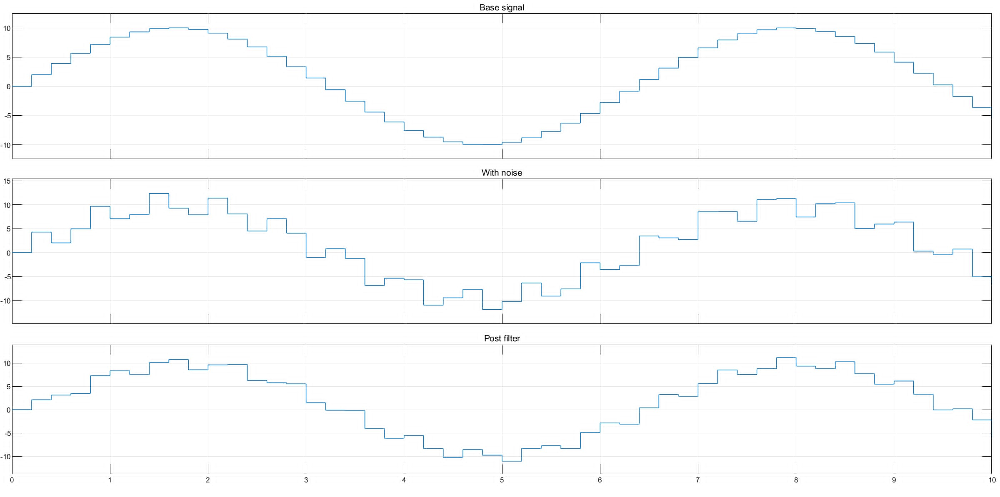
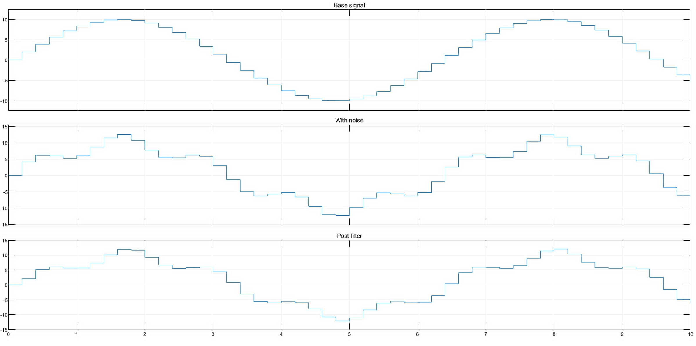
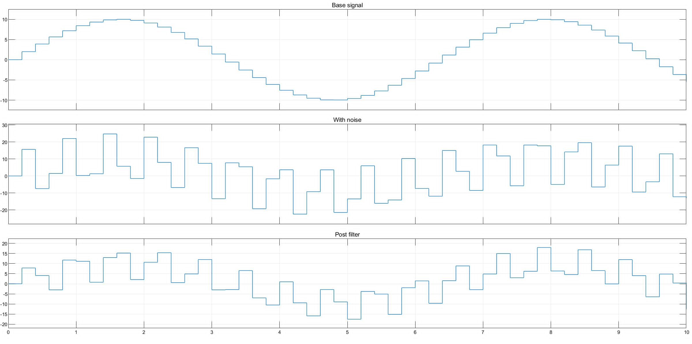
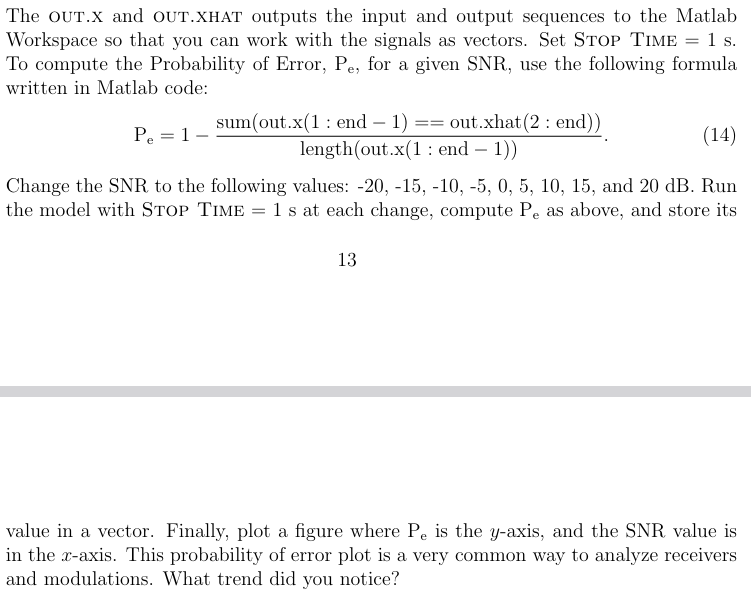

# Exercise 2

## Play with the parameters of the noise signal. What happens if the noise signal’s amplitude and frequency are close to the base signal? What about the contrary?

The closer the noise signal gets to the base filter in frequency, the worse the filtering is. (It is only a first order filter)

### 10 rad/s noise

### 50 rad/s noise

### 5 rad/s noise

### 1.5 rad/s noise

## Back to the original parameters, compare the performance of a first-order moving average and a second-order moving average.

the second order filter might be sligthly better.

# Exercise 3

## Add the scopes and try to interpret/analyze the provided system by relating each signal and step with the mathematical description introduced above. Set Stop Time= 0.1 s, meaning that you will analyze 10 bits. What is the current SNR?

The current SNR is 20dB as defined in the AWGN block.
This could also be calculated using the input and output signal from the AWGN block, however doing that seems a litte stupid.

## B 

## Instead of generating random bits, there is a way to put a signal of your preference by using a block available on Source, for example, an image. Try to do so, and after the communication process, you can reconstruct the message. Change the SNR values to see how the communication affects the recovered image quality. OBS: To simplify, search for an image of black and white pixels.
